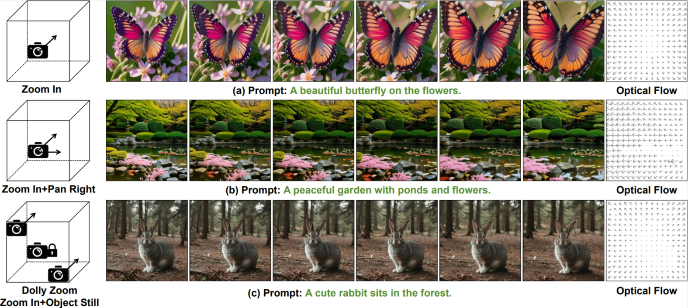
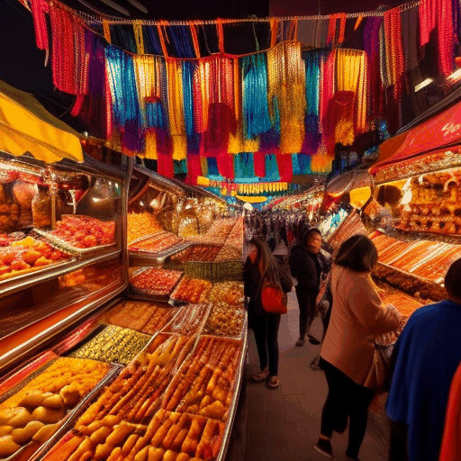
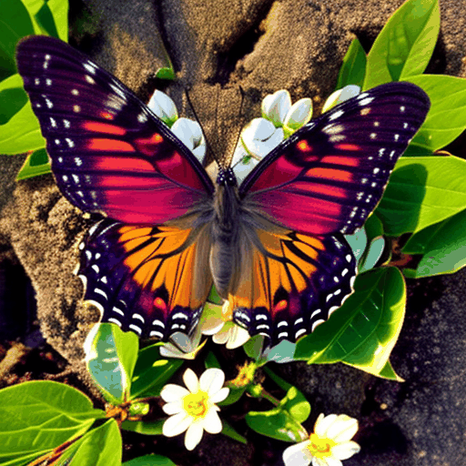

# MotionMaster: Training-free Camera Motion Transfer For Video Generation

###  [Paper](https://arxiv.org/abs/2404.15789) |   [Page](https://sjtuplayer.github.io/projects/MotionMaster/)

<!-- <br> -->
[Teng Hu](https://github.com/sjtuplayer), 
[Jiangning Zhang](https://zhangzjn.github.io/),
[Ran Yi](https://yiranran.github.io/), 
[Yating Wang](https://github.com/sjtuplayer/MotionMaster),
[Hongrui Huang](https://github.com/sjtuplayer/MotionMaster),
[Jieyu Weng](https://github.com/sjtuplayer/MotionMaster),
[Yabiao Wang](https://scholar.google.com/citations?hl=zh-CN&user=xiK4nFUAAAAJ),
 and [Lizhuang Ma](https://dmcv.sjtu.edu.cn/) 
<!-- <br> -->


[//]: # ([![Alt text]&#40;__assets__/imgs/Motionmaster.png&#41;]&#40;https://www.youtube.com/watch?v=o3Fk4RgWC4A&#41;)




## Schedule 

- [x] **Release the one-shot camera-motion transfer code
- [ ] **Expected to release the few-shot camera-motion transfer code before 2024.10.20


## Quick Demos

Result of motion transfer without mask from a sudden zoom in video:

<table class="center" width="100%">
    <tr>
        <td width="25%" align="center" valign="top">
            
            <div style="width: 100%; word-wrap: break-word; white-space: normal; font-weight: bold;">source video</div>
        </td>
        <td width="25%" align="center" valign="top">
            
            <div style="width: 100%; word-wrap: break-word; white-space: normal; font-size: smaller;">"stormy river, rapids crashing against rocks, mist rising, dark clouds overhead, zoom in, 8k uhd, dslr, film grain"</div>
        </td>
        <td width="25%" align="center" valign="top">
            
            <div style="width: 100%; word-wrap: break-word; white-space: normal; font-size: smaller;">"night market, colorful stalls, people walking, food vendors cooking, zoom in, 8k uhd, dslr, vibrant colors, high quality"</div>
        </td>
        <td width="25%" align="center" valign="top">
            
            <div style="width: 100%; word-wrap: break-word; white-space: normal; font-size: smaller;">"close-up of a dragonfly, forest background, sunlight through trees, slow zoom, macro shot, 8k uhd, dslr, cinematic lighting"</div>
        </td>
    </tr>
</table>


Result of motion transfer with a zoom-in video and its mask:

<table class="center" width="100%">
    <tr>
        <td width="25%" align="center" valign="top">
            
            <div style="width: 100%; word-wrap: break-word; white-space: normal; font-weight: bold;">source video</div>
        </td>
        <td width="25%" align="center" valign="top">
            
            <div style="width: 100%; word-wrap: break-word; white-space: normal; font-size: smaller;">"night forest, moonlight filtering through trees, light fog, owls hooting, zoom out, 8k uhd, dslr, cinematic lighting"</div>
        </td>
        <td width="25%" align="center" valign="top">
            
            <div style="width: 100%; word-wrap: break-word; white-space: normal; font-size: smaller;">"distant view of a lighthouse on a cliff, stormy sea, waves crashing, dramatic lighting, dark clouds, 8k uhd, high contrast"</div>
        </td>
        <td width="25%" align="center" valign="top">
            
            <div style="width: 100%; word-wrap: break-word; white-space: normal; font-size: smaller;">"close-up of a butterfly on a flower, macro shot, soft breeze, sunlight through leaves, 8k uhd, dslr, cinematic lighting"</div>
        </td>
    </tr>
</table>


## Prepare


### 🛠️ Prepare the environment

```
Ubuntu
python 3.9
cuda==11.8
gcc==7.5.0
cd AnimateDiff

pip install -r requirements.txt
```


### 🍺 Checkpoint for AnimateDiff

We use [AnimateDiff v2](https://github.com/guoyww/AnimateDiff?tab=readme-ov-file) in our model. Feel free to try other versions of AnimateDiff. Moreover, our model also works in other video generation model
that contains temporal attention module. (e.g., [Stable video diffusion](https://github.com/Stability-AI/generative-models) and [DynamiCrafter](https://github.com/Doubiiu/DynamiCrafter)).

- Download checkpoints for AnimateDiff v2
  `mm_sd_v15_v2.ckpt` ([Google Drive](https://drive.google.com/drive/folders/1EqLC65eR1-W-sGD0Im7fkED6c8GkiNFI?usp=sharing) / [HuggingFace](https://huggingface.co/guoyww/animatediff) / [CivitAI](https://civitai.com/models/108836/animatediff-motion-modules)) 
  and put it in `models/Motion_Module/`.

- Download <a href="https://civitai.com/models/4201/realistic-vision-v20">Realistic Vision V2.0</a> 
  and put it in `models/DreamBooth_LoRA/`.


### 📖 Prepare reference video and prompts

Prepare your reference video.

Edit `configs\prompts\v2\v2-1-RealisticVision.yaml` to make sure `video_name` is the file path to your reference video.

If mask is wanted, set `use_mask=True` and make sure `mask_save_dir` is the file path to your mask.

## 🚀 Launch the sampling script

###  Motion Transfer

MotionMaster can transfer the motion from the given reference video by substituting the temporal attention map:

```
python scripts/motionconvert.py --config configs/prompts/v2/v2-0-RealisticVision.yaml
```

Edit `video_name` in `configs\prompts\v2\v2-0-RealisticVision.yaml`. The generated samples can be found in `samples/` folder.

###  One-shot camera motion disentanglement

For one-shot camera motion disentanglement, you should prepare a reference video and the corresponding mask (suggest to use [SAM](https://segment-anything.com/)) by 
editing `video_name` and `mask_save_dir` in `configs\prompts\v2\v2-1-RealisticVision.yaml`. Then run:

```
python scripts/motionconvert.py --config configs/prompts/v2/v2-1-RealisticVision.yaml
```

The generated samples can be found in `samples/` folder.

##  Few-shot camera motion disentanglement

Coming Soom.

## Citation

If you find this code helpful for your research, please cite:

```
@misc{hu2024motionmaster,
      title={MotionMaster: Training-free Camera Motion Transfer For Video Generation}, 
      author={Teng Hu and Jiangning Zhang and Ran Yi and Yating Wang and Hongrui Huang and Jieyu Weng and Yabiao Wang and Lizhuang Ma},
      year={2024},
      eprint={2404.15789},
      archivePrefix={arXiv},
      primaryClass={cs.CV}
}
```